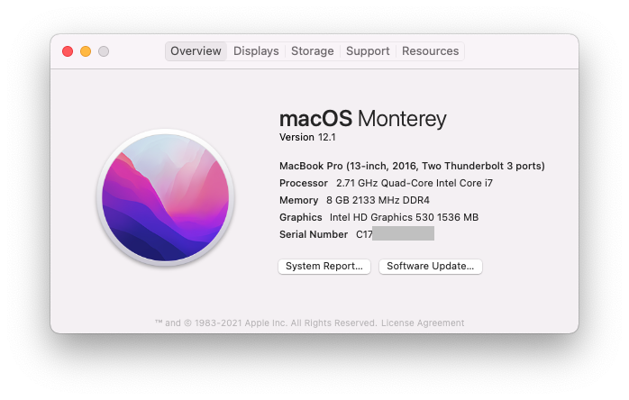

# Hackintosh Monterey Guide for Dell Precision 3510 (OpenCore 0.7.4)
* Tested with Big Sur and Monteray. Can't boot Catalina (or older?).

## Hardware
**WiFi + BT Combo** | DW1560 (not tested)

## What works
* HDMI works
* Sleep/Wake up OK

## Instructions
### 1. Prepare installation media 
https://dortania.github.io/OpenCore-Install-Guide/extras/big-sur/  
https://dortania.github.io/OpenCore-Install-Guide/extras/monterey.html
### 2. Modify 'config.plist' for your own serial number, UUID, MLB, ROM, etc.
### 3. Copy 'BOOT' and 'OC' directories to the EFI partition of the USB disk.

## Note:
* Doesn't support Catalina. There's a Clover solution for it.

